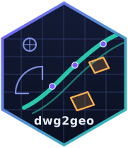

# dwg2geo 

<!-- badges: start -->
[](https://github.com/milkway/dwg2geo-r/actions/workflows/R-CMD-check.yaml)
[](LICENSE.md)
[](https://milkway.github.io/dwg2geo-r/)
<!-- badges: end -->

Convert engineering **DWG drawings to auditable GeoJSON** from R, with no CAD
software, LibreDWG, or GDAL required. dwg2geo wraps the pure-Rust
[dwg2geo](https://github.com/milkway/dwg2geo) conversion core as a native
extension:

- every feature carries resolved CAD style metadata (`layer`, `color_rgb`,
  `color_index`, `linetype`, `lineweight_mm`, text properties);
- skipped and failed entities are **reported with reasons**; nothing is
  silently dropped;
- the output is **deterministic**: the same bytes always produce
  byte-identical GeoJSON on a given platform;
- coordinates stay in the drawing's local system, and the package **never
  guesses a CRS**. Georeferencing is explicit and in your hands.

## Installation

``` r
# install.packages("dwg2geo")  # once on CRAN

# development version (needs Rust >= 1.85: https://rustup.rs)
pak::pak("milkway/dwg2geo-r")
```

## Usage

``` r
library(dwg2geo)

result <- dwg_convert("drawing.dwg")
#> ℹ Converting 'drawing.dwg' (9.0 MB)...
#> ✔ Converted 11781 features from 2793 model-space entities.
#> ! Skipped 145 entities; see `$skipped` for reasons.

result
#> ── dwg2geo conversion ──────────────────────────────
#> • 11781 features from 2793 model-space entities
#> • source SHA-256: "1b8555f87365"…
#> • bbox (local units): [247024.4, 7398959] – [248911, 7400880]
#> ── Converted ──
#> # A tibble: 11 × 3
#>    entity_type count reason
#>    <chr>       <int> <chr>
#>  1 ARC          1839 <NA>
#>  2 CIRCLE        937 <NA>
#> # …

result$skipped
#> # A tibble: 4 × 4
#>   entity_type reason                              count sample_handles
#>   <chr>       <chr>                               <int> <list>
#> 1 ATTDEF      attribute definition template; …       46 <chr [10]>
#> # …
```

### Georeference with sf

The GeoJSON keeps the drawing's local coordinates. Read it as an
[sf](https://r-spatial.github.io/sf/) object, set the CRS you *know* the
drawing uses, and reproject:

``` r
library(sf)

shapes <- dwg_convert("drawing.dwg") |>
  dwg_as_sf() |>
  st_set_crs(31983) |>       # SIRGAS 2000 / UTM 23S: you must know this
  st_transform(4326)

plot(shapes["layer"])
```

## Why fail closed on CRS?

A DWG can be drawn in SIRGAS 2000 / UTM, a local engineering grid,
millimetres, or arbitrary coordinates. GeoJSON that merely copies CAD
coordinates can be syntactically valid while geographically wrong, so
dwg2geo always returns local coordinates and leaves the CRS decision to
you, explicitly.

## The dwg2geo family

The same audited core is available everywhere:
[CLI + Rust crate](https://github.com/milkway/dwg2geo) ·
[npm (WebAssembly)](https://www.npmjs.com/package/dwg2geo) ·
[PyPI](https://pypi.org/project/dwg2geo/) ·
[browser app](https://milkway.github.io/dwg2geo-app/) (upload a DWG and see
it on a map, entirely client-side).

## License

MIT © André Leite. The bundled conversion core is MIT; its only
weak-copyleft dependency is [acadrust](https://crates.io/crates/acadrust)
(MPL-2.0).
